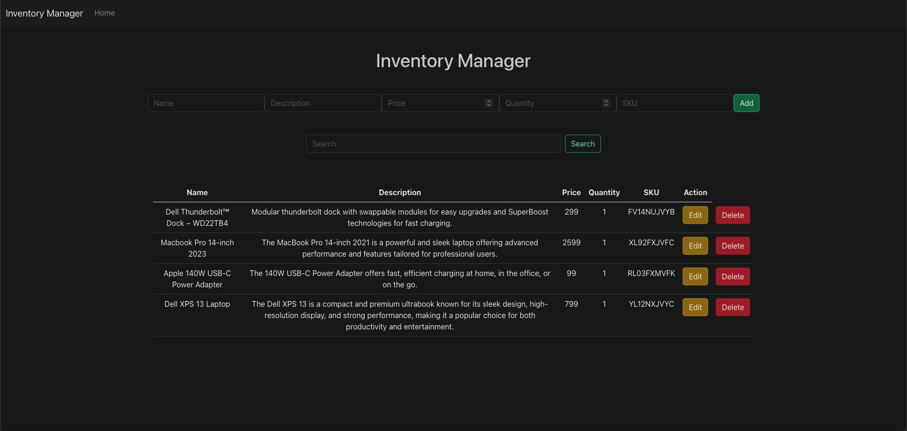

## InventoryManager



## Overview

Inventory Manager is a web application designed to help users manage their inventory efficiently. It provides functionalities for adding, updating, and deleting products from the inventory, as well as viewing detailed information about each product.

## Features

- **Product Management:** Add, update, and delete products from the inventory.
- **Detailed Product Information:** View detailed information about each product, including name, description, price, quantity, and SKU.
- **User Authentication:** Secure user authentication system to ensure only authorized users can access the app.
- **Responsive Design:** The app is built with a responsive design, ensuring a seamless experience across various devices and screen sizes.

## Technologies Used

- **Frontend:**
  - React: A JavaScript library for building user interfaces.
  - Bootstrap: A front-end framework for developing responsive and mobile-first websites.
  
- **Backend:**
  - Node.js: A JavaScript runtime environment that executes JavaScript code outside a web browser.
  - Express.js: A minimal and flexible Node.js web application framework that provides a robust set of features for web and mobile applications.

- **Database:**
  - [Insert Database Name]: [Brief description of the database used, e.g., MongoDB for storing product data].

## Installation

1. Clone the repository:

   ```bash
   git clone [repository-url]
   ```

2. Navigate to the project directory:

   ```bash
   cd inventory-manager-app
   ```

3. Install dependencies:

   ```bash
   npm install
   ```

4. Start the development server:

   ```bash
   npm start
   ```

5. Open the app in your web browser:

   ```
   http://localhost:3000
   ```

## Contributing

Contributions are welcome! If you'd like to contribute to the project, please fork the repository, make your changes, and submit a pull request.

## License

[Insert License Here]
```

Feel free to customize this template according to your specific project requirements and add more details as needed!
